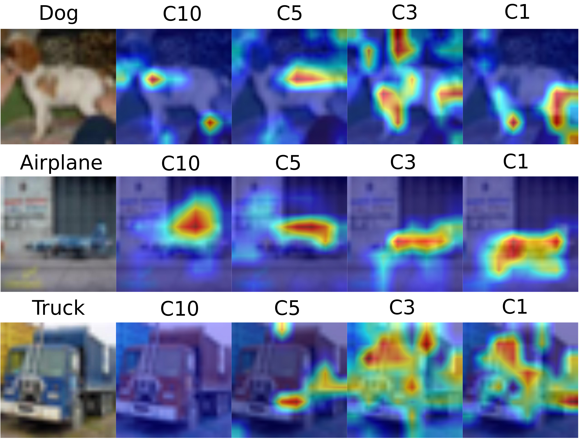

# Grad-CAM Visualizations for MSD-Net

This repository contains the code for visualizing the model proposed in the paper Multi-Scale Dense Networks
for Resource Efficient Image Classification [link](https://arxiv.org/pdf/1703.09844.pdf). The base code here for that paper is borrowed from the wonderfully replicated work of @avirambh from [here](https://github.com/avirambh/MSDNet-GCN). Also for Grad-CAM, the basic code is taken from [here](https://github.com/leftthomas/GradCAM). Here is a more generalized version that can be used for any custom network.

Also checkout my two part blog on this. [Part-1](http://siddharthasaxena.com/blog/Visualizing-MSD-Net-with-Grad-CAM-Part-1), 
[Part-2](http://siddharthasaxena.com/blog/Visualizing-MSD-Net-with-Grad-CAM-Part-2)


Download the trained MSD-Net models for Cifar-10 from [here](https://www.dropbox.com/s/kjxh1oaxkhtpbmw/anytime_cifar_10.pth.tar)

First we can test the model for accuracies the pre-trained models as 
```bash
python main.py --model msdnet -b 20  -j 2 cifar10 --growth 6-12-24 --gpu 0 --resume --evaluate-from anytime_cifar_10.pth.tar
```
This nearly replicates the original paper which reports about 94.5% when budget is averaged.

| Classifier No.|  Accuracy |
|---------------|----------|
| 0:            | 90.800 | 
| 1:            | 92.330 | 
| 2:            | 93.180 | 
| 3:            | 93.760 | 
| 4:            | 94.140 | 
| 5:            | 94.130 | 
| 6:            | 94.270 | 
| 7:            | 94.220 | 
| 8:            | 94.210 | 
| 9:            | 94.170 |
| **Mean**          | **93.521**  |

This table also shows that the accuracy generally increases as number of blocks increase. 

Print whether the classifiers are predicting each point correctly or not
```bash
python heatmapping.py --model msdnet -b 20  -j 2 cifar10  --growth 6-12-24 --gpu 0 --resume --evaluate-from anytime_cifar_10.pth.tar
```

Print whether the classifiers after each blocks are predicting correctly or not for a particular class
```bash
python heatmapping.py --model msdnet -b 20  -j 2 cifar10  --growth 6-12-24 --gpu 0 --resume --evaluate-from anytime_cifar_10.pth.tar --cl=dog # here dog is the class name
```

Create the heatmap of a particular classifier and image
```bash
python heatmapping.py --model msdnet -b 20  -j 2 cifar10  --growth 6-12-24 --gpu 0 --resume --evaluate-from anytime_cifar_10.pth.tar --imgNo=100 --maxC=5 # this means img 100 predicted with classifier 5 will be generated in folder diags
```

Some samples of the same are as follows

